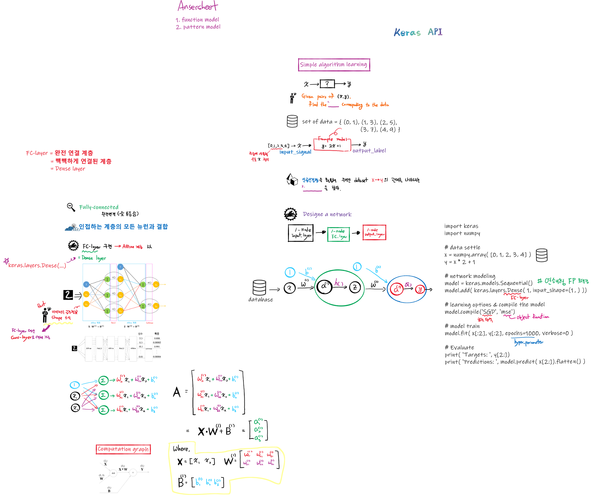

# Import subpackages in Keras 
필수 서브 패키지 두 가지 

## 1. models

A. C. F. P
> Add: 계층 연결 <br/>

> Compile: 모델 컴파일<br/> 

> Fit: 학습 실행<sub>(execute learning)</sub> <br/>

> Predict: 예측 (or test)

<br/>

## 2. layers
재료 공급 (= 레고 블럭) 
> 계층을 생성하는 클래스 제공 

<br/>

***

## 모델 구현을 위한 코딩 방식 
모델링 방법 x 프로그래밍 방식 = 4가지 

* 모델링 방법    : 연쇄형 or 분산형 <br/>
* 프로그래밍 방식: 함수형(FP) or 객체지향(OOP) <br/> 


>분산 방식 모델링                      ⇒  신호 연결 자유로움 → 복잡한 구조 설계 <br/>

>연쇄 방식<sub>sequential</sub> 모델링 ⇒  일련의 순서대로 계층을 더해가는 방식 → 설계 쉬움<br/>

>혼합 방식 모델링                      ⇒  두 방식을 섞음 
<br/>

***
##  코드 패턴  
※ Dense layer = fully-connected layer 
> 빽빽하게 연결된 계층 = 완전 연결 계층 

```python 
(0) 학습 데이터 준비; (입력, 라벨)               x = numpy.array( [0, 1, 2, 3, 4] ) 
                                               y = x * 2 + 1 

(1) 연쇄형 FP로 인공신경망 모델을 만들겠음        model = keras.models.Sequential() 

(2) 신경망 계층을 생성하고 연결함                model.add( keras.layers.Dense( 1, input_shape=(1,) ))  #깊이:1 , 입렵노드 1개 

(3) 모델 학습 옵션 설정 & 컴파일                 model.compile( 'SGD', 'mse' )              

(4) 학습 데이터를 입력하고 학습 시작              model.fit( x[:2], y[:2], epochs = 1000, verbose = 0)   # verbose: 학습 진행 사항의 표시 여부 
> Supervised learning in this case

(5) 모델 테스트                                  print("Target_label: ", y[2:])
                                                print("Predictions: ", model.predict( x[2:]).flatten() ) 
```
***
## Map 

