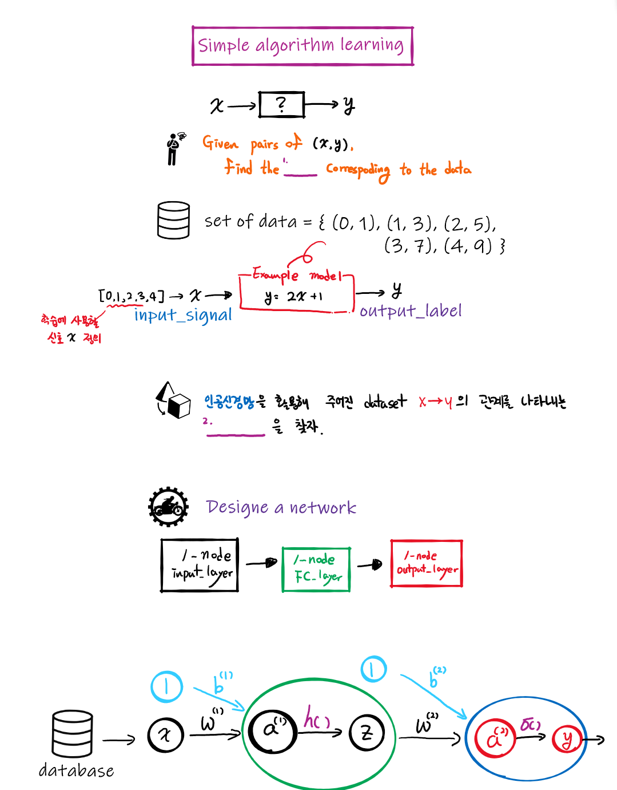

# Number prediction model

<b>Finding a simple function model</b> corresponding to the input-output relationship of a given dataset   

## Solution process 
(1) Get a dataset having input & output  
(2) Find a model which can represent the pattern of your given dataset
> Design a network model & train it 

 

## Implementation with
* [Keras](https://github.com/DoranLyong/DL_coding_master/tree/master/Practic1/Keras) 
* Only numpy 

*** 
# Problem 

# Terminology 
* FC-layer 
> fully-connected layer = Dense layer 
> 완전 연결 계층 = 빽빽하게 연결된 계층 