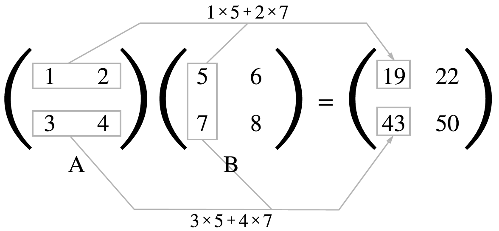
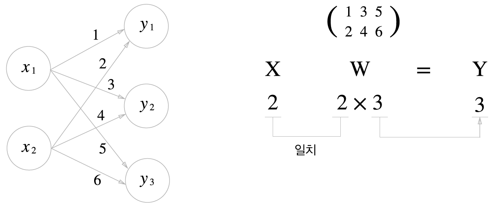

[ (Self_tutorial) ](https://github.com/DoranLyong/DL_coding_master/tree/master/Self_tutorial)

# 신경망에서의 행렬 곱 
* 다차원 배열 (Tensor) 계산 
* [행렬곱 with numpy ](#2.행렬의_곱)
    > '[배열 곱](https://github.com/DoranLyong/DL_coding_master/tree/master/Self_tutorial/Requirement#Numpy)' 과의 차이점 이해 
* [신경망의 신호전달을 '<b>행렬 곱</b>'으로 구현](#3.신경망에서의_행렬_곱)

<br/>

## 1. 다차원 배열 (Tensor)
* 기본: '숫자의 집합' 
    > 1차원, 한 줄로 늘어선 것 (n,) ⇒ Vector <br/>

    > 2차원, 직사각형으로 늘어놓은 것 (n,m)⇒ Matrix <br/>

    > 3차원 이상으로 늘어놓은 것 (n, m, z)⇒ Tensor 

※ [배열 자료 구조](https://github.com/DoranLyong/DL_coding_master/tree/master/Self_tutorial/Requirement#Numpy)

__EXAMPLE__ -- 1차원 배열
```python
>> A = np.array( [1, 2 ,3, 4] )  # 인스턴스 A를 
                                 #값 [1, 2, 3, 4]를 가지고 <numpy> 클래스로 초기화 
>> print(A)
[1, 2, 3, 4]

>> np.ndim(A)   # 몇 차원(dimension)? 
1

>> A.shape    # shape은? 
(4,)

>> A.shape[0]
4 
```
<br/>

__EXAMPLE__ -- 2차원 배열 


```python
>> B = np.array( [ [1,2], [3,4], [5,6] ] )
>> print(B) 
[[1 2]
 [3 4]
 [5 6]]

 >> np.ndim(B)    # 몇 차원?
 2

 >> B.shpae 
 (3, 2)            # 3 x 2 

```

<br/>

## 2.행렬의_곱
* matrix_product 
    * [array_product와의 차이점?](https://github.com/DoranLyong/DL_coding_master/tree/master/Self_tutorial/Requirement#Numpy)
        > 배열 곱: 요소별 곱(element-wise product)

    * np.dot(A, B)
    > A●B <br/>
    > 점곱 (dot product))



```python
>> A = np.array( [ [1, 2], [3, 4] ])
>> B = np.array( [ [5, 6], [7, 8] ])

>> C = np.dot(A, B)    # C = AB 
>> C 
array([[19, 22],
       [43, 50]])
```

<br/>

## 3.신경망에서의_행렬_곱 
* 편향<sub>bias</sub> & 활성화 함수<sub>activation_function</sub> 생략 



```python
>> X = np.array( [1, 2])
>> W = np.array([ [1, 3, 5], [2, 4, 6] ])

>> Y = np.dot(X, W)    # Y = XW 
>> Y 
array([ 5, 11, 17])
```