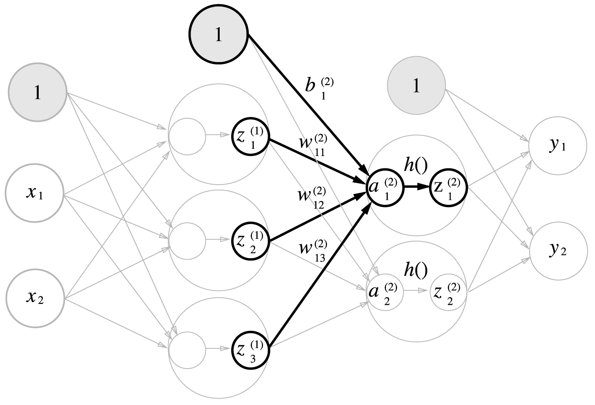

[ (Self_tutorial) ](https://github.com/DoranLyong/DL_coding_master/tree/master/Self_tutorial)

# 신경망의 신호전달 구현 

예시_3층 신경망
> input_layer (0층) 노드 2개 <br/>

> hidden-layer1 (1층) 노드 3개 

> hidden-layer2 (2층) 노드 2개 

> output-layer (3층) 노드 2개 

※ [신경망에서의 행렬 곱](https://github.com/DoranLyong/DL_coding_master/tree/master/Self_tutorial/0_dot_array)


<br/>

## (1) 입력층에서 1층으로 신호 전달 


```python
X  = np.array( [1, 5] )  # (2,) shape 
W1 = np.array( [ [1, 2 ,3], [4, 5, 6] ]) 
B1 = np.array( [10, 11, 12] )

A1 = np.dot(X, W1) + B1    # Broad casting 

"""
A1 == np.array( [a11, a12, a13] )
"""
```

## (2) 1층에서 2층으로 신호 전달 


```python
Z1 = relu(A1)    # 활성화 함수 거침 

W2 = np.array([ [1, 2], [4, 5], [7, 8] ])
B2 = np.array( [10, 11] )

A2 = np.dot(Z1, W2) + B2 

"""
A2 = np.array( [a21, a22] )
"""
```

## (3) 2층에서 1층으로 신호 전달 


```python
Z2 = relu(A2)    # 활성화 함수 거침 

W3 = np.array( [ [1, 2], [4, 5] ])
B3 = np.array( [10, 11] )

A3 = np.dot(Z2, W3) + B3 

Y  = softmax(A3)

"""
Y = np.array( [y1, y2] )
"""
```

<br/>

# 구현 정리 
* forward( ) 
    > 순전파 (신호가 순방향으로 전파됨)을 나타냄; propagation 

    ※ 신호가 역방향(backward)으로 전파 ⇒ backpropagation 
    > '신경망 학습<sub>learning</sub>에 사용 

```python
def init_weight(): 
    weight = {}     # <dict> 클래스로 인스턴스 
                     # { 'W' : <array> }

    # input -> 1-layer                      
    weight['W1'] = np.array( [ [1, 2 ,3], [4, 5, 6] ])
    weight['B1'] = np.array( np.array( [10, 11, 12] ) )  

    # 1-layer -> 2-layer 
    weight['W2'] = np.array([ [1, 2], [4, 5], [7, 8] ])
    weight['B2'] = np.array( [10, 11] )

    # 2-layer -> output-layer
    weight['W3'] = np.array( [ [1, 2], [4, 5] ])               
    weight['B3'] = np.array( [10, 11] )

    return weight

def forward( weight, X ): 
    # Weights
    W1, W2, W3 = weight['W1'], weight['W2'], weight['W3']
    B1, B2, B3 = weight['B1'], weight['B2'], weight['B3']

    A1 = np.dot(X, W1) + B1 # input -> 1-layer 
    Z1 = sigmoid(A1)

    A2 = np.dot(Z1, W2) + B2 # 1-layer -> 2-layer 
    Z2 = sigmoid(A2)

    A3 = np.dot(Z2, W3) + B3 # 2-layer => output-layer 
    Y  = softmax(A3)

    return Y 


def main():
    weights = init_weight()   # set of weights 
    X = np.array( [1, 0.5] )  # input_data
    Y = forward( weights, X ) # output


if __name__ == "__main__":
    main()
```