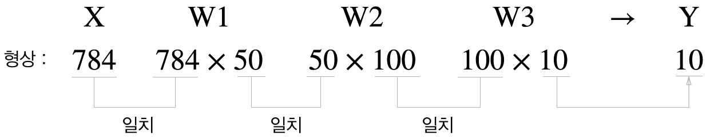
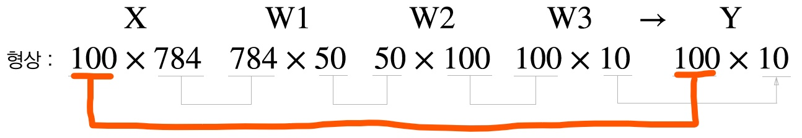

[ (back) ](https://github.com/DoranLyong/DL_coding_master/tree/master/Self_tutorial/2_inference/MNIST_classify)
# 배치 처리 (batch process)
※ p. 102, 239 

* batch : (일괄적으로 처리되는) 집단, 무리 
    * A group 
        > which is dealt with <b>at the same time</b> or is sent to a particular place <b>at the same time</b><br/>
    
<br/>

"한입만!!!" <br/>
한입 크게 베어먹으면 빨리 먹을 수 있음 


<br/>

### 즉, 배치 처리(batch process)
* 묶음 입력 데이터 만들기 <br/>

    <b>EXAMPEL__</b> 100만원 지불하기 <br/>
    * non-batch ⇒ 1만원 씩 100번 넣기 
    * batch ⇒ 100만원 한 뭉치 넣기 

<br/>

## 종류 
(1) 한 번에 다 넣기는 넘 크다. 조금 작은 덩어리로
* mini-batch <br>

(2) Convolution layer을 위한 batch process? 

<br/>


## 배치 처리 전후 비교 
* [MINIST 숫자 분류 예시 참고](https://github.com/DoranLyong/DL_coding_master/tree/master/Self_tutorial/2_inference/MNIST_classify/2_classify_network)

### 1. 배치 처리 前 - 이미지 데이터 1장만을 입력했을 떄의 처리 흐름 
* '[행렬의 곱](https://github.com/DoranLyong/DL_coding_master/tree/master/Self_tutorial/0_dot_array)'이 가능한 형상을 가짐 
```python 
>> nx_test, _ = load_normal_data()   
>> weights = load_weight() 
>> W1, W2, W3 = weights['W1'], weights['W2'], weights['W3']

>> nx_test.shape()    # 테스트 데이터 셋의 형상(shape) 총 10000장의 (784,) 벡터로 저장됨  
(10000, 784)
>> nx_test[0].shape   # 평활화(flatten)된 이미지의 형상(shape)
(784,)
>> nx_test[9999].shape
(784, )

>> W1.shape           # input -> 1층 있는 가중치 edge 형상(shape)
(784, 50)
>> W2.shape
(50, 100)
>> W3.shape
(100, 10)
```



<br/><br/>

### 2. 배치 처리 後 - 이미지 데이터를 여러장 입력했을 때의 처리 흐름 
* [MINIST 숫자 분류 예시에 추가](https://github.com/DoranLyong/DL_coding_master/tree/master/Self_tutorial/2_inference/MNIST_classify/2_classify_network)

* input_data를 (784,) → (100, 784) 형태로 바꿈 
    > 배치 처리 <br/>
    > x_batch = nx_test[ i : i+batch_size ]
    * output의 형상<sub>shape</sub>은 (10, ) → (100, 10) 형태로 바뀜 
        > 100장의 입력 데이터에 대한 결과를 한 번에 출력됨 


```python
...(생략)...


nx_test, nt_test = load_normal_data() 
weights = load_weight() 

# Settle the b____ size
batch_size = 100 

# (3) Inference
accuracy_cnt = 0 

for i in range(0, len(xn_test), batch_size):  # range(start, end, step_size)
    x_batch = nx_test[i : i+batch_size]
    y_batch = classify( weights, x_batch )

    p = np.argmax( y_batch, axis=1 )

    accuracy_cnt += np.sum( p == nt_test[i:i+batch_size] )

print("Accuracy to normalized: {}".format(float(accuracy_cnt)/len(nx_test)) ) 
```



***
## NOTE__ 배치 처리의 이점(advantage) 
p. 103
* 컴퓨터로 계산할 때의 효율성 
    > 이미지 1장당 처리 시간을 대폭 줄여줌 <br/>
    * (이유1) 수치 계산 API(e.g, numpy)가 <b>큰 배열 연산에 최적화</b> 돼 있어서 
    * (이유2) 데이터 버스(bus)에 주는 부하를 줄여줌 
        > 메모리로 부터 데이터를 읽는 횟수가 줄어듬★ → 컴퓨터 전체 적으로 속도가 빠른 CPU or GPU의 수행 비율이 높아짐 → 전체 처리 속도가 빨라지는 효과<br/>
        > ( 큰 신경망에서는 데이터 전송이 '병목'으로 작용함. 그래서 배치 처리를 하면 부담을 줄일 수 있음 )

