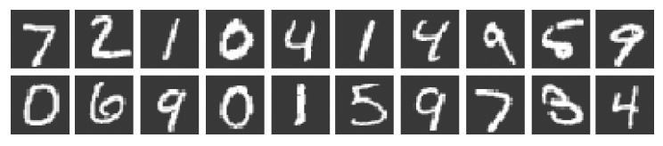

[ (back) ](https://github.com/DoranLyong/DL_coding_master/tree/master/Self_tutorial/2_inference)

# MNIST number classification 

p.96  

모델이 학습됐다고 가정한 상태로 진행 
> 사전 훈련된 모델을 통해 '추론' 단계 구현 

## Dataset
* [MNIST_database](http://yann.lecun.com/exdb/mnist/)

* 구성 
    > 0 ~ 9 의 숫자 이미지  
    * size: (28, 28)  
    * ndim: gray_scale ... (1-channel) 
    * value_range: [0, 255]  
    * train_set : 60,000장 , test_set: 10,000장   
     

    > 각 이미지에 ground_truth인 숫자 라벨label 이 붙어 있음

    

 

* 활용 방식 
    > Model learning with the <b>train_set </b>

    > Performance evaluation with the <b>test_set  </b>

   

## 실습 단계 
(1) [데이터셋을 내려받아(download) 이미지를 넘파이 배열(array)로 변환](https://github.com/DoranLyong/DL_coding_master/tree/master/Self_tutorial/2_inference/MNIST_classify/1_data_process)

(2) [신경망의 추론 처리 (for classification)](https://github.com/DoranLyong/DL_coding_master/tree/master/Self_tutorial/2_inference/MNIST_classify/2_classify_network)
> 모델이 학습 됐다고 가정  

(3) [배치 처리(batch)](https://github.com/DoranLyong/DL_coding_master/tree/master/Self_tutorial/2_inference/MNIST_classify/3_batch_process)
