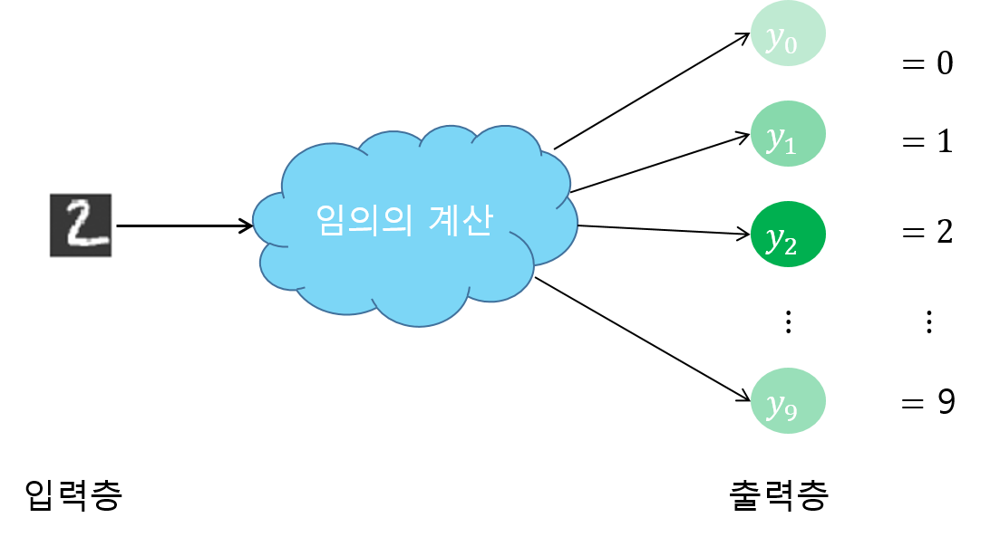

[ (Self_tutorial) ](https://github.com/DoranLyong/DL_coding_master/tree/master/Self_tutorial)
# 추론(Inference)
학습이 끝난 모델로 입력에 대한 결과 예측하기 
(prediction)

* Machine Learning 작업 2 가지  
    (1) 학습(learning)  
    (2) 추론(inference)  
    ※ p.95, 176 

* 추론의 종류  
    (1) 분류 - classification  
    (2) 회기 - regression  
    (3) 분할 - segmentation  
    etc.

* 추론 단계 구현 tip  
    * 출력 계층의 활성화 함수인 softmax 생략 (p.95, 176)
        > 판단_문제(decision)에서는 높은 점수만 찾으면 되니까 

    * 분류 문제(classification)
        > 분류하고 싶은 클래스 수 = 출력층의 노드 수  

        >ex) MNIST  
        분류할 숫자 클래스 수 = 출력노드 수 = 10

        
        

