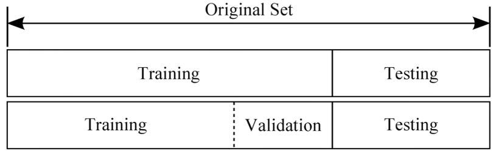

[(back)](https://github.com/DoranLyong/DL_coding_master/tree/master/Self_tutorial/3_learning/MNIST_learning)

# 데이터를 취급할 때 주의할 점 
학습에 필요한 데이터를 어떻게 관리하고 주의할 점은 무엇인지 정리해보자. 

 

## 1. Data split 
### (1) 준비된 데이터를 다음과 같이 3개로 쪼갠다 
* training set훈련 집합, validation set검증 집합, testing set시험 집합
    * 훈련 데이터: 모델을 학습시켜 최적의 가중치 매개변수를 찾을 때 사용 
    * 검증 데이터: 학습된 모델의 성능 평가 
        > train acurracy와 validation accuracy가 비슷하다 ⇒ overfitting이 적다  
    * 시험 집합: unseen 데이터를 통해 모델의 성능 평가 

        > 

### (2) 왜 쪼개나? 
* 범용화된(=일반화된) 모델을 찾기 위함 
    > 벙용 능력: 아직 보지 못한 데이터(except 훈련 데이터)로도 문제를 올바르게 풀어내는 능력 