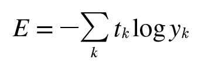
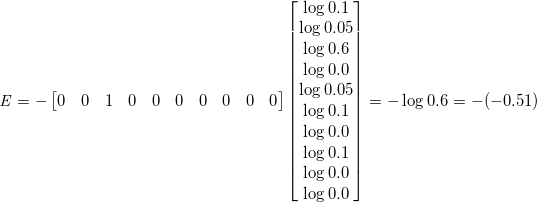
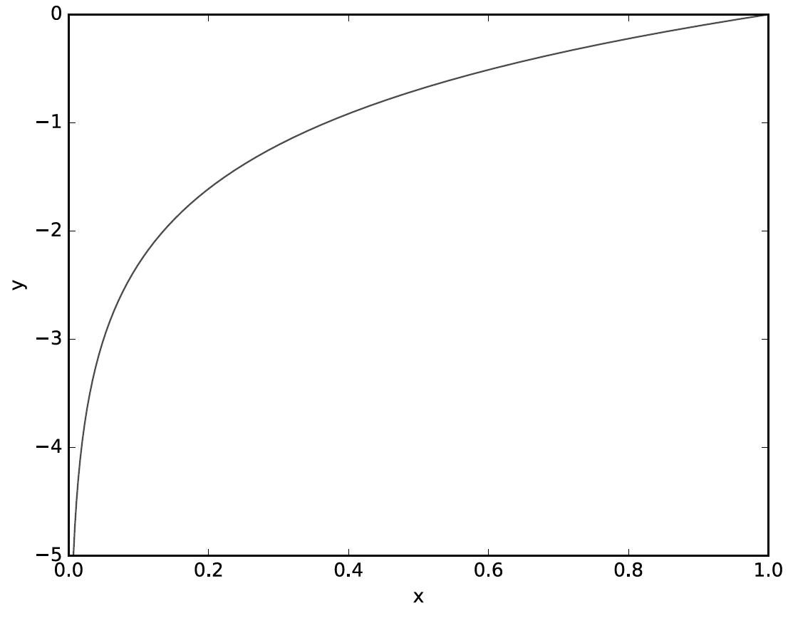
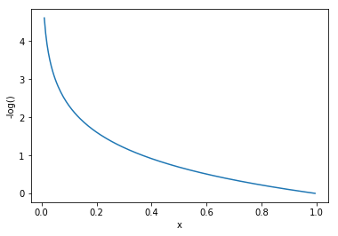

[(back)](https://github.com/DoranLyong/DL_coding_master/tree/master/Self_tutorial/3_learning/MNIST_learning/2_loss_function)

# Cross Entropy Error (CEE)
### [교차 엔트로피 오차(CEE)](https://blog.naver.com/cheeryun/221380130245) <br/>



<br/>



* k : 데이터의 차원 수 
* y<sub>k</sub>: 신경망의 출력 (신경망이 추정한 값)
* t<sub>k</sub>: 정답 레이블 by [one-hot encoding](https://blog.naver.com/cheeryun/221378622013)
    * 실질적으로 정답일 때의 추정(t<sub>k</sub>가 1일 때의 y<sub>k</sub>)의 자연로그를 계산한 식 
        > ∴ '교차 엔트로피 오차' : 정답일 때의 출력이 전체 값을 정함

※ w.r.t
* log : 밑이 e인 자연로그(ln = log<sub>e</sub>) 
    * 상용로그 : log10() 으로 표현 


 <br/>
* 자연로그 y = log(x)의 그래프 

 <br/>
* CEE = -log( ) 그래프 
* y 출력 → 정답(1)  ⇒ CEE → 0 
    > 출력이 정답에 가까우면, 오차는 0에 가까워짐 


# 구현 
* p.114 참고 
* MNIST 숫자 분류기 출력단 참고

```python 
def CEE(y, t):       # (출력 노드, 타겟_레이블)
    delta = 1e-7     # 오버플로우 방지(y=0에서 -inf 되는 것 방지, p.93 )
    return -np.sum( t * np.log(y + delta))

>> t = [0, 0, 1, 0, 0, 0, 0, 0, 0, 0]
>> y = [0.1, 0.05, 0.6, 0.0, 0.05, 0.1, 0.0, 0.1, 0.0, 0.0]
>> CEE(np.array(y), np.array(t))
0.510825457099338     # 0.51 정도 나쁨 

>> y = [0.1 , 0.05, 0.1, 0.0, 0.05, 0.1, 0.0, 0.6, 0.0, 0.0]
>> CEE(np.array(y), np.array(t))
2.302584092994546     # 2.30 정도 나쁨 
```
y 출력에서 2번 째 노드의 출력값이 0.6으로 제일 크다 
> 신경망은 정답이 '2일' 확률을 0.6이라고 추정함 

정답 레이블도 타겟이 '2'로 원핫 인코딩 돼 있음 
>  ```[0, 0, 1, 0, 0, 0, 0, 0, 0, 0]```

CEE = 0.51
> '나쁨 정도'가 0.097 


7 번째 노드가 0.6으로 제일 크다고 추정했을 때는 CEE = 2.30임 
> 즉, 결과(오차 값)가 더 작은 첫 번째 추정이 정답일 가능성이 더 높다고 판단함 