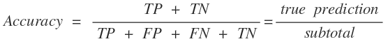
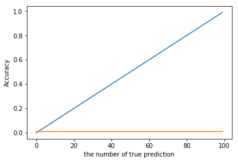

[(back)](https://github.com/DoranLyong/DL_coding_master/tree/master/Self_tutorial/3_learning/MNIST_learning/2_loss_function)

# [왜 손실 함수를 지표로 사용할까?](https://blog.naver.com/cheeryun/221387314571)

### 우리가 원하는 건 (목적)
* ### 주어진 데이터를 ```정확하고 정밀하게 예측하는 모델```을 만드는 것

### 우리의 목표는 
* ### '<b>정확도</b>(accuracy)'를 최대로 끌어내는 매개변수 값을 찾는 것.

<br/>
그렇다면,

##  평가 지표를 '<span style="color:skyblue"> 얼마나 좋으냐</span>(accuracy)'를 사용하는게 더 자연스럽지 않나? <br/>
* ### <span style="color:orange">손실 함수의 값<sup>(=얼마나 나쁜가요?)</span>을 통해 우회적으로 평가하는 미유는?
    * 신경망 학습에서의 '미분'의 역할 때문 
        > 활성화 신호 값을 미분 

<br/>

※ 확률에서 우회적으로 표현하는 수식 
* P(A) = 1 - P(A<sup>c</sup>)

<br/>

# 신경망 학습에서 '미분'의 역할 
* ### 매개변수의 갱신 방향을 찾아주는 역할 

    * ### 최적의 매개변수(bias<sup>편향</sup>, weight<sup>가중치</sup>)를 탐색할 때, <br/>
        > <span style="color:orange">손실 함수의 값을 최소로 하는</span>매개변수 값을 찾아야 함  
    * ### 이때, 매개변수의 미분값(=기울기)을 계산함
        > 그 미분 값을 단서<sup>cue</sup>로 해서 매개변수의 값을 서서히 갱신하는 과정을 반복 

        

<br/>

## (1) '가중치 매개변수에 대한 손실 함수의 미분'의 의미 
* ### ```가중치를 조금 변화 시켰을 때, 손실 함수가 어떻게 변하니?```

<br/>

## (2) 매개변수 갱신 방법 
* ### 미분값 < 0  ⇒ 매개변수를 양의 방향으로 변환(=이쪽 방향이다 계속해) → 손실 함수 값을 줄임
* ### 미분값 > 0  ⇒ 매개변수를 음의 방향으로 변환(=반대 방향으로 돌려) → 손실 함수 값을 줄임 
* ### 미분값 = 0 ⇒  매개변수를 어느 쪽으로든 움직여봄 → 손실 함수 값 변화 無 →  <span style="color:orange">갱신 멈춤 </span>

<br/>

# 정확도를 지표로 삼으면 안 되는 이유 
### 정확소를 지표로 삼으면, <br/>
### (정확도 함수의) 미분 값이 대부분의 장소에서 0이 됨 → ```매개변수를 갱신할 수 없음```

<br/>

## (1) 왜 정확도 함수의 미분이 대부분의 장소에서 0이 되지?



### <b>Example</b>_ 만약, 100장의 훈련 데이터 중 32장을 올바르게 예측했다면, 
* ### ⇒ Accuracy = 32 / 100 = 0.32 

### <b>Example</b>_ 만약, 100장의 훈련 데이터 중 33장을 올바르게 예측했다면, 
*  ### ⇒ Accuracy = 33/ 100 = 0.33 

<br/>

### 즉, 정확도 함수 f(x) = x / 100 

### ⇒ f'(x) = 1 / 100 = 0.3
> ```f'(x)```는 상수 함수임 ☞ 변화가 없음(= 미분값 0) 

 파랑: f(x), 주황: f'(x)

<br/>

## (2) 정확도 함수의 도함수가 1/N (=0.0xx) 이라는 것은?
* ### 정확도 32%인 상태에서 매개변수 값을 조금 바꿔도 정확도는 32% 
    * 변화율이 0.0xx 이기 때문에 정확도 변화도 미묘함 
    * 즉, ```매개변수를 약간만 조정해서는``` 정확도 개선이 안됨 
        * 개선 되더라도 연속 값이 아닌 ```불연속적인 값으로 변함```
            > 32% → 32.0123% (X) <br/>
            > 32$ → 33% ... (당연하지 맞춘 개수는 이산값이니까)