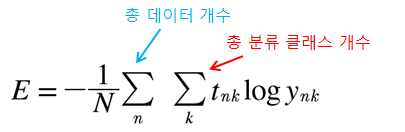
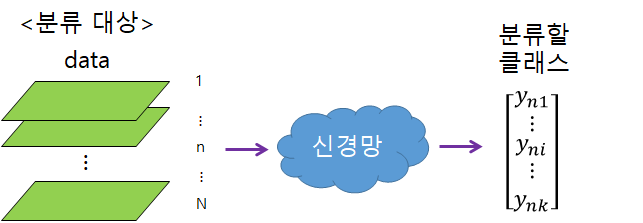

[(back)](https://github.com/DoranLyong/DL_coding_master/tree/master/Self_tutorial/3_learning/MNIST_learning)

# [미니배치 학습 (mini-batch learning)](https://blog.naver.com/cheeryun/221380230376)

[Batch 처리](https://github.com/DoranLyong/DL_coding_master/tree/master/Self_tutorial/2_inference/MNIST_classify/3_batch_process) → 크흠... 한 번에 너무 많으니까 Loss function 구하기 빡신데? → 그럼 mini-batch 


## 배치(batch)처리 vs 미니배치(mini-batch learning)
* p.102, 배치 처리: 
    > 입력 데이터를 한번에 넣기 
* p.115, 미니배치 학습: 
    > 모든 훈련 데이터에 대한 손실 함수를 한번에 구하기 

<br/>

표현은 달리 했지만 맥락은 똑같음: <br/>
이미지를 한 장씩 넣으면 번거롭다 → 한 뭉탱이로 넣자```(batch 처리)``` → 60,000장 뭉탱이를 한 번에 넣고 학습하기에는 손실함수 구할 때 빡시다 → 그러면 100장 뭉탱이만 넣어서 하자```(mini-batch)``` 

*** 

## 탄생 배경 
※ ```모델의 학습 상태가 얼마나 나쁜지 수치화```: [손실 함수(loss function)](https://github.com/DoranLyong/DL_coding_master/tree/master/Self_tutorial/3_learning/MNIST_learning/2_loss_function)

<b>__ML 문제 풀이법__</b>
* 훈련 데이터에 대한 ```손실 함수의 값을 구함```
* 그 값을 최대한 줄여주는 ```매개변수를 찾는 과정을 반복```
    * 즉, ```모든 훈련 데이터를 대상으로``` 손실 함수 값을 구해야함 
    > ex) 훈련 데이터 100개 → 100개의 손실 함수 값을 구하고 그 합(合)을 지표로 삼음 

<br/>


## 한번에 모든 훈련 데이터에  대한 손실 함수 구하기 (= 평균 손실 함수)
[이전에는](https://github.com/DoranLyong/DL_coding_master/tree/master/Self_tutorial/3_learning/MNIST_learning/2_loss_function) 데이터 하나에 대한 손실 함수만 구함 

<br/>

모든 훈련 데이터에 대한 CEE<sup>cross-entropy error</sup> 손실 함수의 합은, 

 
* N : 총 데이터 개수 
* k : 한 데이터의 차원 수 
* t<sub>nk</sub>: n번째 데이터의 k번째 정답 레이블 값 
* y<sub>nk</sub>: n번째 데이터의 k번째 신경망 출력 

※ 헷갈리면 [(참고1)](https://blog.naver.com/cheeryun/221380130245) [(참고2)](https://github.com/DoranLyong/DL_coding_master/tree/master/Self_tutorial/3_learning/MNIST_learning/2_loss_function/2_CEE)

### ★ 마지막에 N으로 나누어 (1/N) 정규화 시킴 
⇒ ```평균 손실 함수```를 구함  
> 각 데이터에 대한 손실 함수 값 분포를 평균냄 

※ [평균](https://blog.naver.com/cheeryun/221336576844): 데이터 분포의 대푯값 구하기 

###  전체 평균 손실 함수의 문제점 
훈련 데이터 집합이 많으면 시간이 많이 듬 
* ex) 훈련 데이터 60,000개 → 손실 함수 값 60,000개 구함 → 평균냄 
    > (빅 데이터 수준으로 더 많아지면 계산이 현실적으로 힘듬)

이런 경우 데이터 일부를 추려 전체의 '근사치'로 이용해야 함 (=미니 배치)

* ex) 훈련 데이터 60,000개 → 여기서 100개만 무작위로 뽑아라 → 손실 함수 값 100개 구함 → 100개에 대한 평균냄 
    > 모집단으로 전체 계측 

*** 
##  미니배치(mini-batch)학습 방법
* [입력 데이터 미니 배치 처리](https://github.com/DoranLyong/DL_coding_master/tree/master/Self_tutorial/3_learning/MNIST_learning/3_mini-batch/mini_batch_learning)
* [배치용 손실 함수 구현](https://github.com/DoranLyong/DL_coding_master/tree/master/Self_tutorial/3_learning/MNIST_learning/3_mini-batch/batch_CEE)