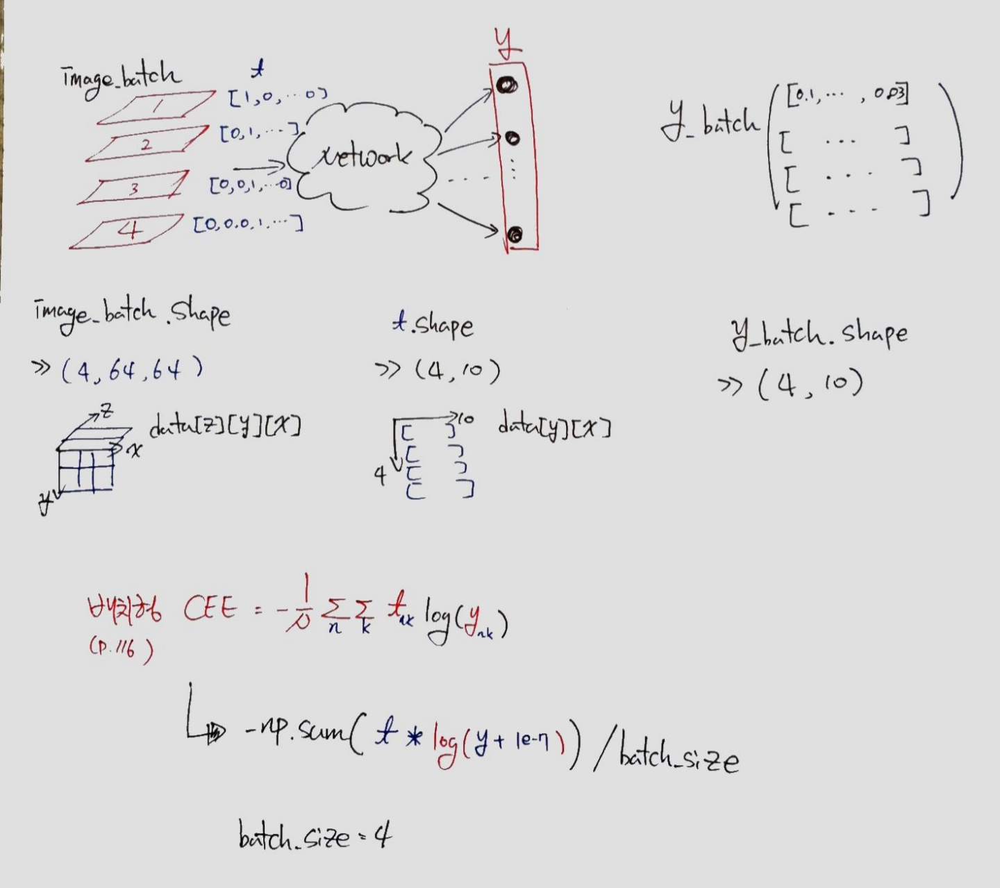
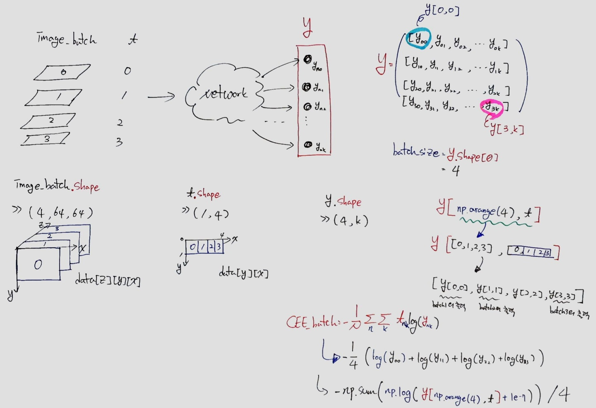

[(back)](https://github.com/DoranLyong/DL_coding_master/tree/master/Self_tutorial/3_learning/MNIST_learning/3_mini-batch)

# [(배치용) 교차 엔트로피 오차 구현 - batch CEE](https://blog.naver.com/cheeryun/221380874718)
미니배치 같은 배치 데이터를 지원하는 손실 함수 구현하기 
* p.118

※ [데이터 하나에 대한 CEE](https://github.com/DoranLyong/DL_coding_master/tree/master/Self_tutorial/3_learning/MNIST_learning/2_loss_function/2_CEE)(데이터를 하나씩 처리하는 구현)를 조금 수정하면 됨 <br/>
※ [전체 데이터에 대한 CEE](https://github.com/DoranLyong/DL_coding_master/tree/master/Self_tutorial/3_learning/MNIST_learning/3_mini-batch) 수식 

<br/>

##  구현 내용 및 방식 
* 입력 데이터가 하나일 때와 배치로 묶인 경우를 모두 처리할 수 있는 구현 
* ```delta = 1e-7``` [(오버플로우 방지)](https://github.com/DoranLyong/DL_coding_master/tree/master/Self_tutorial/3_learning/MNIST_learning/2_loss_function/2_CEE)
* ```t * np.log(y + delta)```  [원소별 곱셈](https://github.com/DoranLyong/DL_coding_master/tree/master/Self_tutorial/Requirement#Numpy)

### (1) 정답 레이블이 one-hot encoding일 때 
```python
def cross_entropy_error(y, t):
    
    delta = 1e-7
    if y.ndim == 1:   # 데이터 하나일 때 
        t = t.reshape(1, t.size)   # (t.size,) 벡터에서 (1, t.size) 행렬로 변환 
        y = y.reshape(1, y.size) 
    
    batch_size = y.shape[0]
    return -np.sum( t * np.log( y + delta) )y / batch_size
```
<center></center>


### (2) 정답 레이블이 '2'나 '7' 처럼 숫자 레이블로 주어졌을 때 
* [배열 자료구조](https://github.com/DoranLyong/DL_coding_master/tree/master/Self_tutorial/Requirement#Numpy)
* [행렬 곱으로 CEE 계산](https://github.com/DoranLyong/DL_coding_master/tree/master/Self_tutorial/3_learning/MNIST_learning/2_loss_function/2_CEE)
```python 
def cross_entropy_error(y, t): 
    
    delta = 1e-7 
    if y.ndim == 1 : 
        t = t.reshape(1, t.size)
        y = y.reshape(1, y.size)
    
    batch_size = y.shape[0]
    return -np.sum( np.log( y[np.arange(batch_size), t] + delta)) / batch_size 
```
<center></center>

<br/>

*** 
## Numpy 메소드 참고 
```python 

y.ndim  == 1     ==> 벡터 (n,)
y.ndim  == 2     ==> 행렬 (n,m)
```
<b>__EXAMPLE __ </b>
``` python 

list = [ [1,2,3], [4,5,6] ]
y = np.array(list)

y.ndim
>> 2
y.shape
>> (2, 3)
y.size
>> 6
```
<br/>

<b>__EXAMPLE __ </b>
```python 
list = [1,2,3]
y = np.array(list)

y.ndim
>> 1
y.shape
>> (3,)
y.size
>> 3


```
