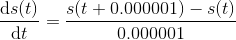

[(back)](https://github.com/DoranLyong/DL_coding_master/tree/master/Self_tutorial/3_learning/MNIST_learning/4_renew-parameter/1_diff)

# [식 1] 대로 구현해보기 

 


```python 
# 나쁜 구현 예 
def numerical_diff(f, x): 
    #dt = 10e-50  # 조낸 작은 수 0.000000000000....1
    dt = 1e-4
    return (f(x + dt) - f(x)) / dt 
```

<br/>

## ★ 컴퓨터로 '수치 미분'을 수행할 때... 2 가지 문제점이 있음 

<br/>

###  [반올림 오차(rounding error) 문제](https://github.com/DoranLyong/DL_coding_master/tree/master/Self_tutorial/3_learning/MNIST_learning/4_renew-parameter/1_diff/1_diff_eq/rounding_error)
* 컴퓨터가 표현할 수 있는 최소값이 제한 돼 있어서 생기는 문제 
    
    ∴ 컴퓨터가 표현할 수 있는 최소 값으로 dt를 설정해야 함 


<br/>

##  [함수 차분 문제](https://github.com/DoranLyong/DL_coding_master/tree/master/Self_tutorial/3_learning/MNIST_learning/4_renew-parameter/1_diff/1_diff_eq/func_diff)
* 애당초 컴퓨터로 차분을 계산하면 오차가 있음 
    > s(t + dt) -  s(t)
* '중앙 차분'으로 계산 오차를 줄임 


