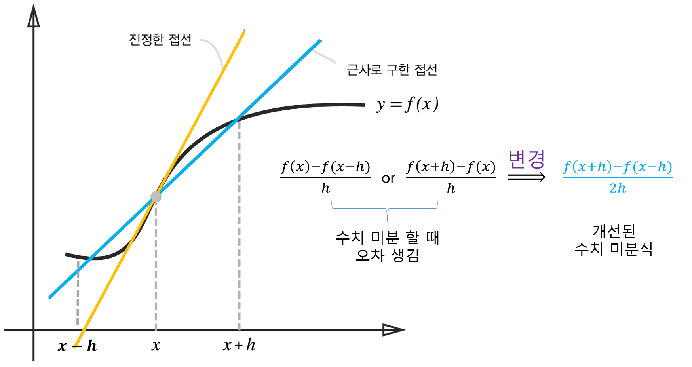

[(back)](https://github.com/DoranLyong/DL_coding_master/tree/master/Self_tutorial/3_learning/MNIST_learning/4_renew-parameter/1_diff/1_diff_eq)

# 함수 차분 문제 
## ※ 함수 f의 차분 
* 임의 두 점에서의 함수 값들의 차이 
    > ### f(x1) -  f(x2)

 

## 진정한 미분(진성한 접선)과 수치 미분(근사로 구한 접선)의 값은 다름 

* 