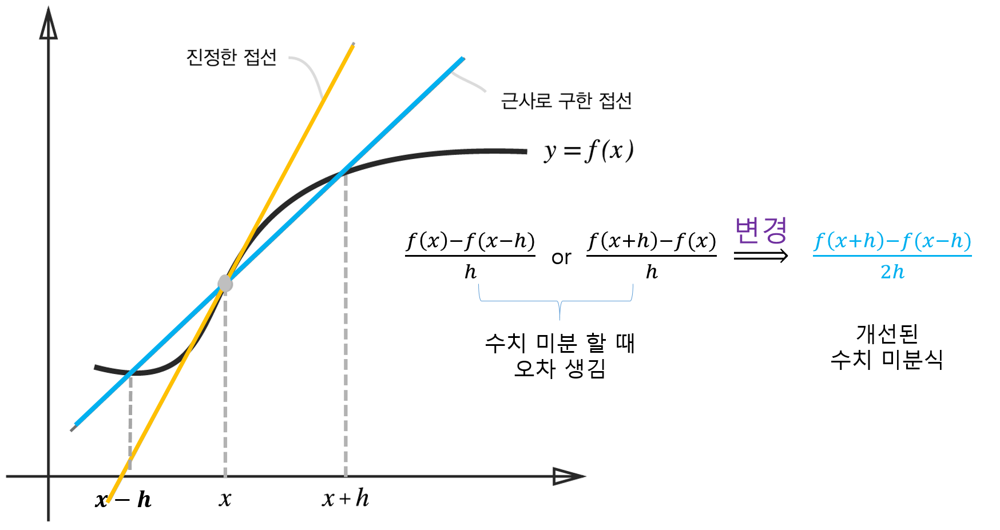

[(back)](https://github.com/DoranLyong/DL_coding_master/tree/master/Self_tutorial/3_learning/MNIST_learning/4_renew-parameter/1_diff/1_diff_eq)

# 함수 차분 문제 
## ※ 함수 f의 차분 
* 임의 두 점 x<sub>1</sub>, x<sub>2</sub>에서의 함수 값들의 차이 
    > ### f(x<sub>1</sub>) -  f(x<sub>2</sub>)


<br/>


## 진정한 미분<sub>(진성한 접선)</sub>과 수치 미분<sub>(근사로 구한 접선)</sub>의 값은 다름 




우리가 이상적으로 구하려는 함수의 기울기(접선)은 <span style="color:orange">노란선</span>에 해당함  <br/>
* [수식대로 구현 한다면](https://github.com/DoranLyong/DL_coding_master/tree/master/Self_tutorial/3_learning/MNIST_learning/4_renew-parameter/1_diff/1_diff_eq) ```(x+h)와 x``` 사이의 기울기에 해당함 

* 하지만, 컴퓨터는 이를 구현 할 수 없다 
    * h → 0 , 무한히 작게 할 수 없으니까  


### ★ 필연적으로 수학적인 미분 정의를 수치 계산으로 구현하면 오차가 포함 됨 
* h → 0 이걸 구현 못해서 


<br/>

##  해결법 
* 계산 오차를 줄여야 한다 
    * (x + h)와 (x - h) 일 때의 함수 ```f()```의 차분을 계산한다 
        > 중심 차분 or 중앙 차분 <br/>
        > ## f(x+h) - f(x-h)

```python 
def centered_diff(f, x):
    dt = 1e-4 # 0.0001
    return (f(x+h) - f(x-h)) / (2*h)
```

<br/>

### ※ 중심 차분(중앙 차분) : 
* x를 중심으로 그 전후의 차분을 계산한다는 의미 


### ※ 전방 차분, 후방 차분 : 
* 전방 차분 : (x + h)와 x의 차분 
* 후방 차분 : (x - h)와 x의 차분 

***
<br/>

# [전방 차분](https://github.com/DoranLyong/DL_coding_master/tree/master/Self_tutorial/3_learning/MNIST_learning/4_renew-parameter/1_diff/1_diff_eq/rounding_error)과 중앙 차분의 수치값 비교 


```python 
""" 전방 차분""" 
def numerical_diff(f, x): 
    #dt = 10e-50  # 조낸 작은 수 0.000000000000....1
    dt = 1e-4
    return (f(x + dt) - f(x)) / dt 

>> python ../rounding_error/numeric_diff.py 
미분계수 = 0.3000009999976072
```

```python 
""" 중앙 차분"""
def centered_diff(f, x):
    dt = 1e-4 # 0.0001
    return (f(x+h) - f(x-h)) / (2*h)


>> python ./centered_diff.py 
미분계수 = 0.2999999999986347
```