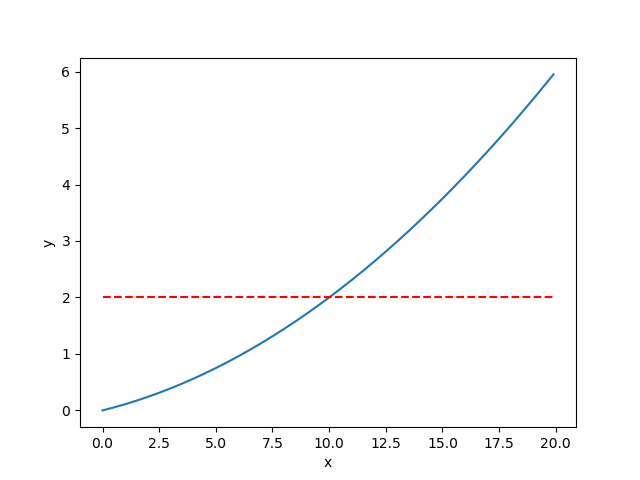
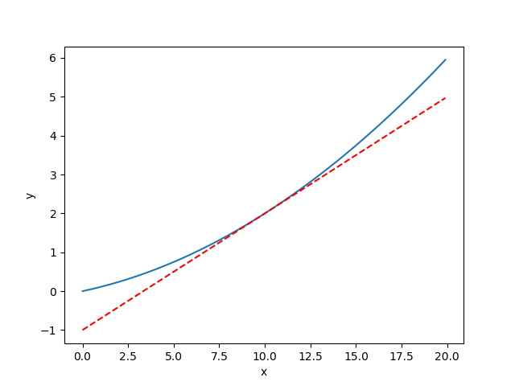

[(back)](https://github.com/DoranLyong/DL_coding_master/tree/master/Self_tutorial/3_learning/MNIST_learning/4_renew-parameter/1_diff/1_diff_eq)

# Rounding Error (반올림 오차)  
### 컴퓨터가 표현할 수 있는 수의 resolution이 제한돼 있어서 생기는 문제 
* ### 숫자가 너무 커 ⇒ overflow 
* ### 숫자가 너무 작아 ⇒ rounding error 


```python 
>> np.float32(10e-50)
0.0 
``` 
* 10e-50은 너무 작아서 컴퓨터가 표현할 수 없음 
    > 0.0으로 인식함 

<br/>

*  개선 하기 
    > 10<sup>-4</sup> = 1e-4   정도면 좋은 결과를 얻는다고 알려짐 

<br/>

***



* dt = 10e-50  일 때, rounding error 때문에 미분계수가 계산 안 됨 

<br/>



* dt = 1e-4 일 때, 컴퓨터가 미분계수 계산 잘 함 


```python 
#!/usr/bin/python
# -*- coding: utf-8 -*- 

import numpy as np 
import matplotlib.pylab as plt 


def function(x):
    return 0.01 * x **2 + 0.1 * x

def tangent_line(f, x, numerical=True):       # f는 예시 함수 f(x)
    if numerical == True:
        d        =  numerical_diff(f, x)      # 점 x에서의 미분값 
        print("수치해석 미분계수 = ", d)

    y_intercept  =  f(x) - d*x
    return lambda t : d*t + y_intercept      # g(x) = f'(5)x + y절편


# 나쁜 구현 예 
def numerical_diff(f, x): 
    #dt = 10e-50  # 조낸 작은 수 0.000000000000....1
    dt = 1e-4
    return (f(x + dt) - f(x)) / dt 


""" 정의역 (domain) """
x = np.arange(0.0, 20.0, 0.1)    # [0.0, 20.0] in 0.1 step
print(x.shape)

""" 치역 (range, =target set) """ 
y = function(x)
print(y.shape)


""" 수치 미분 (numerical diff)"""
xx = 10 
num_div = numerical_diff(function, xx)    # x=10에서의 수치 미분값 
print(num_div)


""" 미분 계수의 접선 구하기 """ 
num_tLine = tangent_line(function, xx, numerical=True)
t_y = num_tLine(x)


""" 그래프 """
plt.xlabel("x")
plt.ylabel("y")

plt.plot(x, y)
plt.plot(x, t_y, '--r')
plt.show()
```