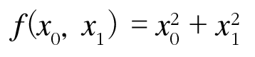

[(back)](https://github.com/DoranLyong/DL_coding_master/tree/master/Self_tutorial/3_learning/MNIST_learning/4_renew-parameter/1_diff)


# 편미분 방법 
다음 다변수 함수 를 편미분 하시오. 

<br/>

## 풀이 방법 

* ### 먼저,  어느 변수에 대한 미분인지를 먼저 구별해야 함 
    * x<sub>0</sub>에 대한 미분 :   
    * x<sub>1</sub>에 대한 미분 : 

* ### 변수가 하나인 함수로 정의하고(나머지 변수는 상수), 그 함수를 미분함 


<br/>

### <b>문제1</b>: x<sub>0</sub>=3, x<sub>1</sub>=4일 때, x<sub>0</sub>에 대한 편미분  를 구하시오 . 

* 수식적 풀이 

    

* 코드 구현 (수치 미분 with [중앙 차분](https://github.com/DoranLyong/DL_coding_master/tree/master/Self_tutorial/3_learning/MNIST_learning/4_renew-parameter/1_diff/1_diff_eq/func_diff))
    ``` python 
    def function( x0 ): 
        return x0**2 + 4**2

    def centered_diff(f, x):
        delta = 1e-4   # 0.0001

        return ( f(x + delta)-f(x - delta) ) / (2*delta)

    >> centered_diff( function, 3.0 )
    6.00000000000378
    ```

    <br/>

 ### <b>문제2</b>: x<sub>0</sub>=3, x<sub>1</sub>=4일 때, x<sub>1</sub>에 대한 편미분  를 구하시오 . 
 * 수식적 풀이 

    
    
* 코드 구현 (수치 미분 with 중앙 차분)
    ``` python 
    def function2( x1 ): 
        return 3.0**2 + x1**2

    def centered_diff(f, x):
        delta = 1e-4   # 0.0001

        return ( f(x + delta)-f(x - delta) ) / (2*delta)

    >> centered_diff( function2, 4.0 )
    7.999999999999119
    ```