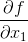

[(back)](https://github.com/DoranLyong/DL_coding_master/tree/master/Self_tutorial/3_learning/MNIST_learning/4_renew-parameter/1_diff)

# [다변수 함수의 기울기(gradient) 구하기](https://blog.naver.com/cheeryun/221398641642)
편미분의 결과인 와 를 <b>벡터로 정리하면</b> 다변수 함수의 <span style="color:skyblue">기울기(gradient)</span>가 됨 
*   

    >  <br/>


``` python 
def function(x):  
    if x.ndim == 1: 
        return np.sum(x**2)      # f(x0, x1) = x0**2 + x1**2

    else: 
        return np.sum(x**2, axis=1)


def numerical_gradient( f, x ):
    h = 1e-4    # 0.0001 
    grad = np.zeros_like(x)      # x와 형상이 같은 zero-배열을 생성 

    for idx in range(x.size):
        tmp_val = x[idx]

        """ f(x+h) 계산 """
        x[idx] = tmp_val + h 
        fxh1 = f(x)

        """ f(x-h) 계산 """ 
        x[idx] = tmp_val - h 
        fxh2 = f(x)

        grad[idx] = (fxh1 - fxh2) / (2*h)

        x[idx] = tmp_val  # 값 복원 
```
