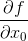

# [다변수 함수의 기울기(gradient) 구하기](https://blog.naver.com/cheeryun/221398641642)
편미분의 결과인 와 를 <b>벡터로 정리하면</b> 다변수 함수의 <span style="color:skyblue">기울기(gradient)</span>가 됨 
*   

    >  <br/>


``` python 


```