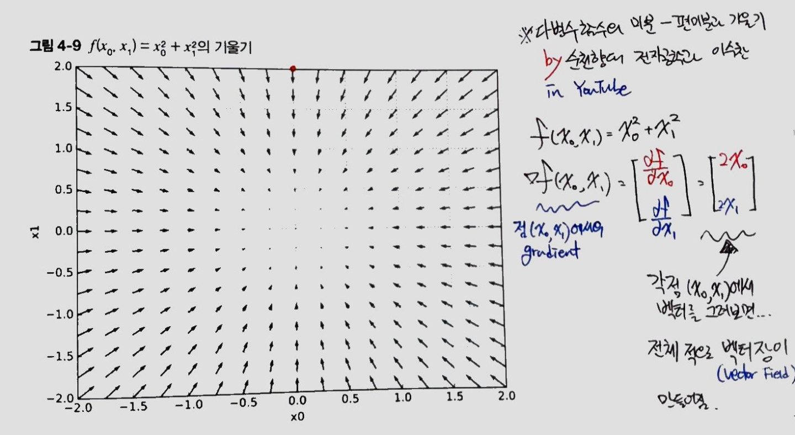
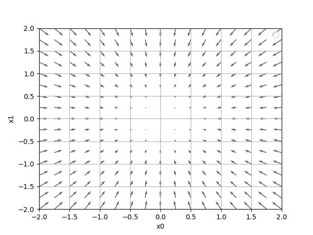
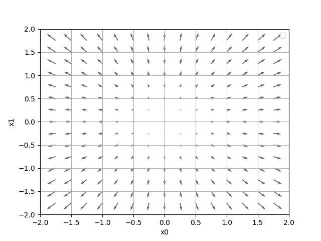

[(back)](https://github.com/DoranLyong/DL_coding_master/tree/master/Self_tutorial/3_learning/MNIST_learning/4_renew-parameter/1_diff)

# [다변수 함수의 기울기(gradient)의 의미](https://blog.naver.com/cheeryun/221398641642)
※ [편미분의 결과를 벡터로 표현한 것](https://github.com/DoranLyong/DL_coding_master/tree/master/Self_tutorial/3_learning/MNIST_learning/4_renew-parameter/1_diff/3_gradient)

<br/>

##  벡터로 표현 됐다는 게 뭘까? 
일단 벡터니까 그려보자 (p.129)



* 기울기(gradient)의 결과에 마이너스를 붙인 벡터로 그림 
    > ※ p. 191 가중치 갱신 
* ## 원래, gradient를 모아둔 벡터장<sup>vector field</sup>은 최대 함수값의 방향을 가리킴 
    * 여기서 마이너스(-)를 붙인 벡터로 그렸기 때문에 최소값의 위치를 가리킴 
        * ∴ 기울기가 가리키는 쪽은 각 장소에서 함수의 출력 값을 가장 크게 줄이는 방향 ★★★★★ 
            >  가중치 갱신은 이 원리를 활용하니까 기억하렴 

    * '가장 낮은 곳'에서 멀어질수록 화살표의 크기가 커짐 
        > '최소 방향으로' 변화를 크게 줘야한다는 의미 


```python 
def plot(X0_flat, X1_flat, grad):
    plt.figure()
    plt.quiver(X0_flat, X1_flat, -grad[0], -grad[1],  angles="xy",color="#666666")#,headwidth=10,scale=40,color="#444444")
    plt.xlim([-2, 2])
    plt.ylim([-2, 2])
    plt.xlabel('x0')
    plt.ylabel('x1')
    plt.grid()
    plt.legend()
    plt.draw()
    plt.show()
```

* ```-grad[0], -grad[1]```로 마이너스를 붙인 벡터 구현 
    >    <br/>
    > 순서대로 ```-grad```  and ```+grad```

<br/>

***

전체 코드 

```python 
#!/usr/bin/python
# -*- coding: utf-8 -*- 


import numpy as np 
import matplotlib.pylab as plt
from mpl_toolkits.mplot3d import Axes3D
from mpl_toolkits import mplot3d    # 3D plotting


def function(x):  # 2변수 함수 값 출력 
    if x.ndim == 1:
        return np.sum(x**2)   # f(x0, x1) = x0**2 + x1**2  

    else:
        return np.sum(x**2, axis=1)


def _numerical_gradient_no_batch( f, x ):
    h = 1e-4    # 0.0001 
    grad = np.zeros_like(x)      # x와 형상이 같은 zero-배열을 생성 

    for idx in range(x.size):
        tmp_val = x[idx]

        """ f(x+h) 계산 """
        x[idx] = tmp_val + h 
        fxh1 = f(x)

        """ f(x-h) 계산 """ 
        x[idx] = tmp_val - h 
        fxh2 = f(x)

        grad[idx] = (fxh1 - fxh2) / (2*h)

        x[idx] = tmp_val  # 값 복원          
    return grad

def numerical_gradient(f, X):
    if X.ndim == 1:
        return _numerical_gradient_no_batch(f, X)
    else:
        grad = np.zeros_like(X)
        
        for idx, x in enumerate(X):
            grad[idx] = _numerical_gradient_no_batch(f, x)
        
        return grad

def plot(X0_flat, X1_flat, grad):
    plt.figure()
    plt.quiver(X0_flat, X1_flat, -grad[0], -grad[1],  angles="xy",color="#666666")#,headwidth=10,scale=40,color="#444444")
    plt.xlim([-2, 2])
    plt.ylim([-2, 2])
    plt.xlabel('x0')
    plt.ylabel('x1')
    plt.grid()
    plt.legend()
    plt.draw()
    plt.show()


def main():

    """ 정의역 (domain) """ 
    x0 = np.arange(-2, 2.5, 0.25)
    x1 = np.arange(-2, 2.5, 0.25) 
    X0, X1 = np.meshgrid(x0, x1)  
    print(X0.shape)      

    # 평활화 
    X0_flat = X0.flatten() 
    X1_flat = X1.flatten()


    """ 기울기 (gradient) """ 
    grad = numerical_gradient(function, np.array([X0_flat, X1_flat]) )
    print(np.array([X0_flat, X1_flat]).shape)


    """ 플로팅 """ 
    plot(X0_flat, X1_flat, grad ) 

    print("Done!")

if __name__ == "__main__":
    main()
```