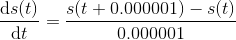
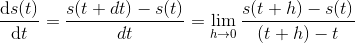

[(back)]()

# 미분 (differentiation)

##  [미분 개념](https://blog.naver.com/cheeryun/221453596358)
* 특정 시점에 가까워 질 때(dt → 0), 이 점 근처의 변화율을 나타내는 최상의 <b>상수 근사값</b>  

    *    <b>[식 1]</b>   
        > 컴퓨터로 계산할 때 

    *   
        > 수학적으로 표현 

 

##  수치 미분의 문제점 

### (1) 