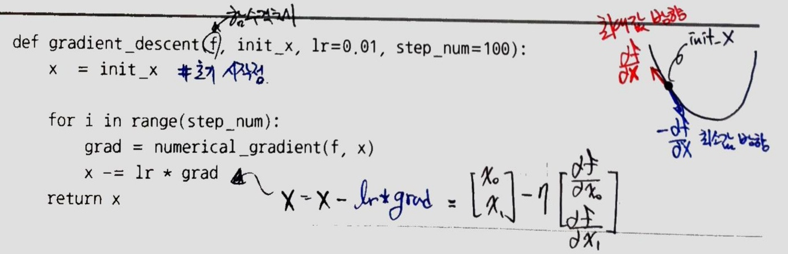

[(back)](https://github.com/DoranLyong/DL_coding_master/tree/master/Self_tutorial/3_learning/MNIST_learning/4_renew-parameter/2_GD)

# 경사 하강법 구현(Gradient Descent method) p.131
### 경사법 수식 


* η <sup>eta</sup> : 학습률(learning rate)
    > (한 번의 학습 후) 매개변수 값을 갱신하는 양을 나타냄 

* 위 수식은 1회 학습 후에 해당하는 갱신 
* 위 수식을 매회 반복함 (함수 값이 줄어들 때 까지)
* 변수의 수가 늘어도 같은 방식(각 변수의 편미분)으로 갱신하면 됨 

<br/>

※ '학습률 값'은 상수로 미리 초기화해 고정한다. 
* 0.01이나 0.001 등 
* 너무 크거나 작으면 '좋은 장소(=최적화 장소)'를 찾을 수 없음 

``` python 
def GD(f, init_x, lr=0.01, step_num=100):
    x = init_x     # 초기 시작점 

    for i in range(step_num):
        grad = numerical_gradient( f, x)
        x -= lr * grad

    return x
```
* [numerical_gradient( )](https://github.com/DoranLyong/DL_coding_master/tree/master/Self_tutorial/3_learning/MNIST_learning/4_renew-parameter/1_diff/3_gradient)

* 

    * ```f``` : 최적화 하려는 함수 
    * ```init_x``` : 초깃값 (=탐색 시작점)
    * ```lr``` : learning rate 
    * ```step_num``` : 탐색 알고리즘 iterate 횟수 