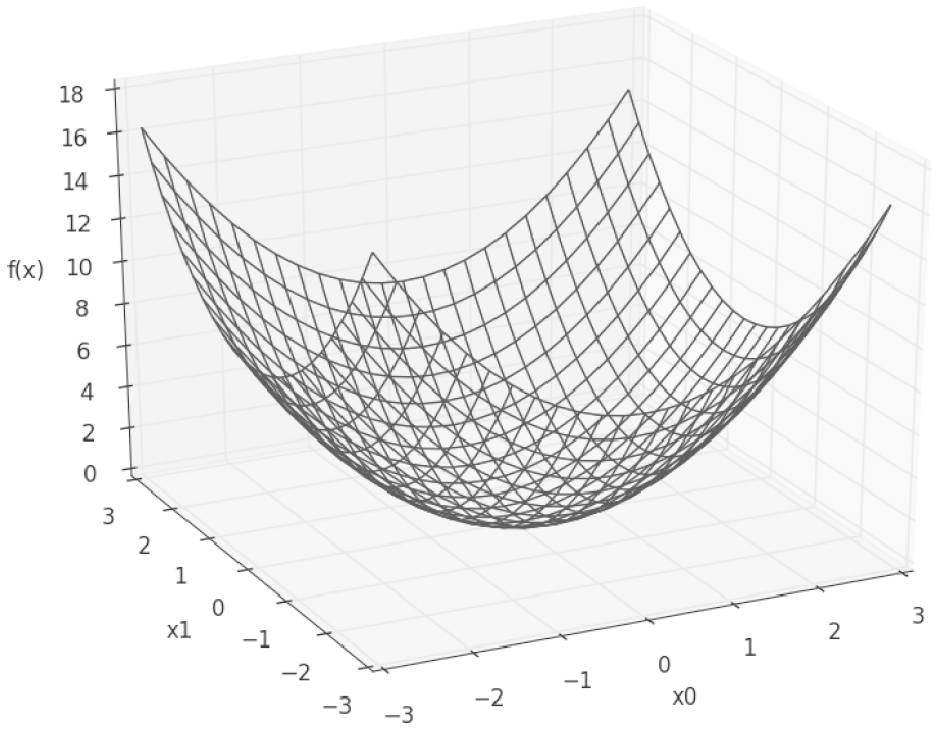
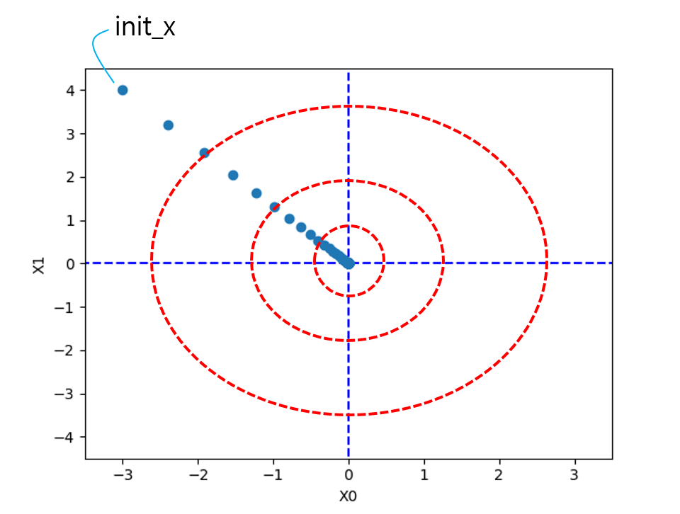
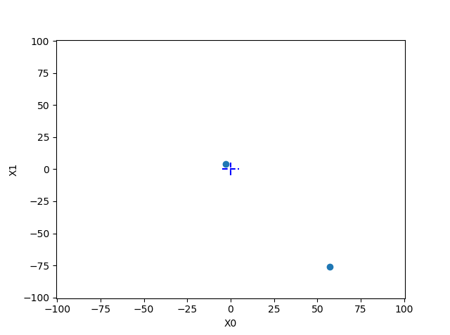
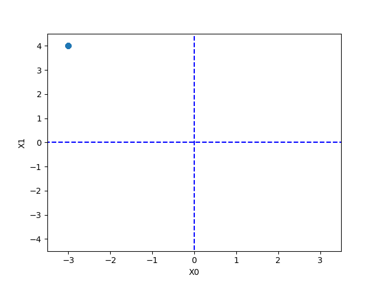

[(back)](https://github.com/DoranLyong/DL_coding_master/tree/master/Self_tutorial/3_learning/MNIST_learning/4_renew-parameter/2_GD)

# 경사 하강법 구현(Gradient Descent method) p.131
### 경사법 수식 


* η <sup>eta</sup> : 학습률(learning rate)
    > (한 번의 학습 후) 매개변수 값을 갱신하는 양을 나타냄 

* 위 수식은 1회 학습 후에 해당하는 갱신 
* 위 수식을 매회 반복함 (함수 값이 줄어들 때 까지)
* 변수의 수가 늘어도 같은 방식(각 변수의 편미분)으로 갱신하면 됨 

<br/>

※ '학습률 값'은 상수로 미리 초기화해 고정한다. 
* 0.01이나 0.001 등 
* 너무 크거나 작으면 '좋은 장소(=최적화 장소)'를 찾을 수 없음 
    * 너무 크면 ⇒ 큰 값으로 발산 
    * 너무 작으면 ⇒ 거의 갱신 안 됨 

* ['hyper parameter 개념' 참고](https://blog.naver.com/cheeryun/221513038055)

``` python 
def gradient_descent(f, init_x, lr=0.01, step_num=100):
    x = init_x     # 초기 시작점 

    for i in range(step_num):
        grad = numerical_gradient( f, x)
        x -= lr * grad

    return x
```
* [numerical_gradient( )](https://github.com/DoranLyong/DL_coding_master/tree/master/Self_tutorial/3_learning/MNIST_learning/4_renew-parameter/1_diff/3_gradient)

* 

    * ```f``` : 최적화 하려는 함수 
    * ```init_x``` : 초깃값 (=탐색 시작점)
    * ```lr``` : learning rate 
    * ```step_num``` : 탐색 알고리즘 iterate 횟수 

    <br/>

*** 

## 예시 문제: 경사법으로 f(x<sub>0</sub>, x<sub>1</sub>) = x<sub>0</sub><sup>2</sup> + x<sub>1</sub><sup>2</sup>의 최솟값 구하기 
* 초깃값을 (-3.0, 4.0)으로 설정 
* 학습률은 0.1로 설정 
* 학습 반복 횟수는 100회 

```python 
import numpy as np 
import matplotlib.pyplot as plt 


def plotting(x_history):
    plt.plot( [-5, 5], [0,0], '--b')
    plt.plot( [0,0], [-5, 5], '--b')
    plt.plot(x_history[:,0], x_history[:,1], 'o')

    plt.xlim(-3.5, 3.5)
    plt.ylim(-4.5, 4.5)
    plt.xlabel("X0")
    plt.ylabel("X1")
    plt.show()

def numerical_gradient( f, x ):
    h = 1e-4    # 0.0001 
    grad = np.zeros_like(x)      # x와 형상이 같은 zero-배열을 생성 

    for idx in range(x.size):
        tmp_val = x[idx]

        """ f(x+h) 계산 """
        x[idx] = tmp_val + h 
        fxh1 = f(x)

        """ f(x-h) 계산 """ 
        x[idx] = tmp_val - h 
        fxh2 = f(x)

        grad[idx] = (fxh1 - fxh2) / (2*h)

        x[idx] = tmp_val  # 값 복원  
        
    return grad


def gradient_descent(f, init_x, lr=0.01, step_num=100):
    x = init_x     # 초기 시작점 
    x_history = []

    for i in range(step_num):
        x_history.append( x.copy() )

        grad = numerical_gradient(f, x)
        x -= lr * grad
    return x, np.array(x_history)

def function(x): 
    return x[0]**2 + x[1]**2
    

def main():
    init_x = np.array( [-3.0, 4.0] ) 
    
    x, x_history= gradient_descent(function, init_x=init_x, lr=0.1, step_num=100)

    print(x)

    plotting(x_history)

if __name__ == "__main__":
    main()
```
```
>> [ -6.11110793e-10   8.14814391e-10]
```

실제로 f(x<sub>0</sub>, x<sub>1</sub>) = x<sub>0</sub><sup>2</sup> + x<sub>1</sub><sup>2</sup>의 최솟값은 (0,0)임 
*  
* [ -6.11110793e-10   8.14814391e-10] 정도면 거의 정확한 결과임 

<br/>

### 학습률이 너무 큰 예시 : ```lr=10.0``` 
* 너무 커서 발산 
```
>> [ -2.58983747e+13  -1.29524862e+12]
```


<br/>

### 학습률이 너무 작은 예시 : ```lr=1e-10```
* 너무 작아서 거의 갱신 안 됨
    * 초기 시작점과 거의 비슷 함 
```
>> [-2.99999994  3.99999992]
```
