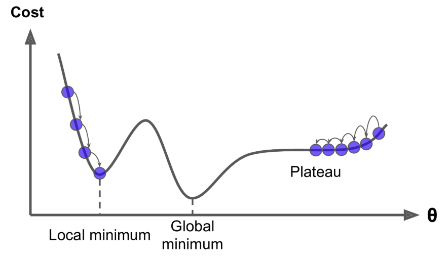

[(back)](https://github.com/DoranLyong/DL_coding_master/tree/master/Self_tutorial/3_learning/MNIST_learning/4_renew-parameter)
# 경사법(경사 하강법) - Gradient Descent 
### 최적 탐색 알고리즘 중 하나 

※ 최적 탐색 알고리즘이란? 
* 신경망의 최적 매개변수(weight, bias)를 찾게 도와주는 알고리즘 
* 최적(optimum): 
    * 신경망 & Machine Learning에서 최적이란? 
        > 손실 함수를 최소로 만드는<sup>(='나쁜 정도'가 최소일 때의)</sup> 매개변수 값  <br/>
        > ``` min Loss(W, B)```

<br/>

## 최적 매개변수를 찾는 과업의 문제점 
* 보통 신경망 모델은 매개변수가 많다 
* 그에 따라 손실 함수의 매개변수도 많다 
    * ```Loss(W, B)```
* 결국 매개변수 공간이 광대해진다... (차원의 저주)

    

<br/>

## 사막에서 바늘 찾기  
이러한 광대한 차원에서 손실 함수의 기울기(gradient)를 잘 이용해 함수의 최솟값을 찾으려는 것이 '경사 하강법'
* ### [gradient_descent 구현]()


<br/>

*** 

## [WARNING]
* 손실 함수의 각 지점에서 함수의 값을 낮추는 방안을 제시하는 지표는 단지 '기울기'뿐 
* 기울기가 가리키는 방향이 Global minima인지는 보장 못함 
    * 복잡한 손실 함수에서는 기울기가 가리키는 방향에 최솟값이 없을 수도 있음 
    * 단지 그 방향으로 가면 <b>지금 보다는 낮아질 것임</b>을 알려줄 뿐 

<br/>

## ★기울기가 0이라도 global minima가 아닌 경우 


### ※ [함수의 극대와 극소(극댓값, 극솟값)](https://m.blog.naver.com/PostView.nhn?blogId=honeyeah&logNo=220270087230&proxyReferer=https%3A%2F%2Fwww.google.com%2F) - relative maximum/minimum
* 극솟값 : 국소적인 최솟값 
    > 한정된 범위에서는 (상대적으로) 최솟값인 점 
* 극댓값 : 국소적인 최대값 

    


<br/>

<b>EXAMPLE</b>: saddle point(안장점)
* 어느 방향에서 보면 극댓값, 다른 방향에서 보면 극소값이 되는 점 
* 그래서 절대적인 global minima라고 할 수 없음 

 

 <br/>

 <b>EXAMPLE</b>: plateau(고원)
 * 평평한 함수 모양 
 * 학습이 진행되지 않는 정체기에 빠트리는 지점 
 
    