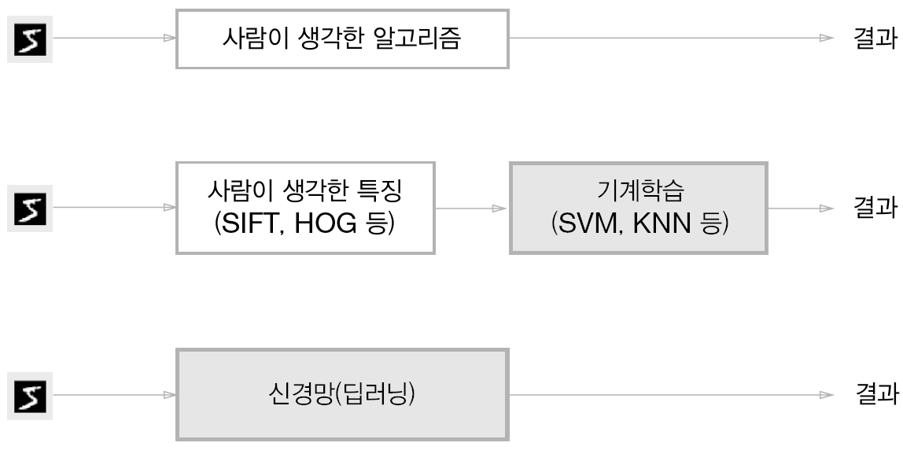

[(Self_tutorial)](https://github.com/DoranLyong/DL_coding_master/tree/master/Self_tutorial)
# 학습(Learning)
## 컴퓨터가 데이터를 가지고 학습한다! 
> 데이터의 패턴(규칙성) 찾기

* Machine Learning 작업 2 가지  
    (1) 학습(learning)  
    (2) [추론(inference)](https://github.com/DoranLyong/DL_coding_master/tree/master/Self_tutorial/2_inference)  
    ※ p.95, 176 

 

### 컴퓨터의 학습(learning)
* 데이터 패턴에 적합한 가중치 매개변수의 최적값을 <b>자동으로 찾는 과정</b>  
    > (모델의 가중치 파라미터를 알아서 찾아주면 좋겠다)

 

### 학습을 시키기 위해 필요한 것?  

* 우리는 시험을 통해 내가 무엇을 공부하고 어느 정도 알고 있는지 측정함 → 부족한 부분 더 공부  

* 컴퓨터를 학습 시킬때도 마찬가지 
    * 모델이 학습된 정도를 나타내는 지표(=가늠자, 시험)
        > 손실 함수(= 목적 함수 or 비용 함수)  
        > Loss(= object, cost) function 

    * 최적 탐색 알고리즘 (최적의 공부 방법 찾기)
        > ex) GD, SGD, Adam ... etc  

    * 매개변수 갱신 (찾은 방법대로 공부한다)  
        >  

 

# '데이터 주도 학습' 개요 
### ★ 기계학습(machine learning)은 데이터가 생명이다. 
* 오로지 데이터로 부터 '패턴을 발견' & '답을 찾음' 
    > 덕분에 사람 중심의 접근방법( e.g. rule-base, logic )에서 벗어남 

 

## 1. ML 프레임워크  

* (1) 특징feature 추출
    * Descriptor(특징 변환기) 以 데이터의 본질적인 정보를 추출하는 과정  
        > 보통 벡터vector자료 구조로 기술함  
        > ex) SIFT, SURF, HOG ... etc.
* (2) 특징 벡터군의 패턴 찾기
    * ML 기술로 학습 시킴 
        > ex) SVM, KNN, Deep Learning ... etc. 

 

## 2. ML 페러다임 변화  
### (1) 전통적인 머신 러닝 기법 
*  특징 추출 + 기계 학습 
    > 여전히 사람이 descriptor를 설계해야함 

### (2) 딥러닝 기법 
* end-to-end machine leanring (종단간 기계 학습)
    > 처음부터 끝까지 '<b>있는 그대로</b>'의 데이터(입력)에서 목표한 결과(출력)을 얻음  
    > (사람의 개입이 일절 없음 )
* '특징 추출' 부분도 컴퓨터가 알아서 해줌 

 

### (※) 신경망(neural network)의 이점  
* 모든 문제를 같은 맥락에서 풀 수 있음 
    * 온전히 주어진 데이터로 부터 패턴을 발견하려고 시도하기 때문 
        > ex) 숫자인식, 동물 인식, 사람 얼굴 인식 등  
        > ☞ 데이터의 세부사항은 달라도 비슷한 맥락에서 문제를 풀 수 있음 

 

# 학습 예시 문제 
* [MNIST 숫자 분류 학습](https://github.com/DoranLyong/DL_coding_master/tree/master/Self_tutorial/3_learning/MNIST_learning)