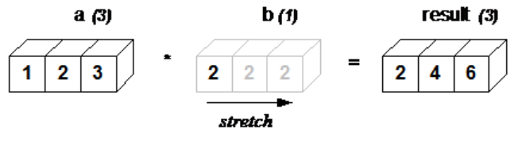

[ (Home) ](https://github.com/DoranLyong/DL_coding_master) <br/>
[ (Self_tutorial) ](https://github.com/DoranLyong/DL_coding_master/tree/master/Self_tutorial)

# Before start...
This tutorial needs below things<br/>

<br/>

## Required packages
* Python3
* Numpy 
* matplotlib 

Installed them with [Anaconda](https://www.anaconda.com/) <br/>

<br/>

# Required Knowledge 
* [python 문법](#python)
* [numpy 연산](#Numpy)
* matplotlib으로 그래프 그리기 


## Python 

### (1) Arithmetic operation
객체를 연산한다 
* 가감승제 
```python 
>> 1 - 2 
-1 

>> 4 * 5 
20 

>> 7 / 5 
python3
1.4
python2
1

>> 3 ** 2 
9
```
※ 나눗셈 연산 
> python2 : 정수끼리 계산한 결과는 반드시 정수, < int ><br/>
> python3 : 정수를 나눈 결과는 실수(부동소수점), < float ><br/>

<br/>

### (2) Data type 
* 객체의 크기를 결정 
>
* 파이썬의 자료형은 총 4 개 
    > < bool >, < int >, < float >, < str >
```python 
>> type(10)
<class 'int'>

>> type("hello")
<class 'str'>
```
※ Python은 모든 것을 객체<sub>object</sub> 개념으로 봄 <br/>

※ 객체<sub>object</sub>
* 실존하는 물체 
    > 물리적으로 공간을 차지하는 물체 
* 컴퓨터 안에서 실존하는 것은? 
    > Memory 공간을 차지하는 정보 ⇒ that is '객체'

<br/>

### (3) Variable 
객체<sub>object</sub>를 저장하기 위해 할당된 <b>메모리의 이름</b>

* 객체를 호출해서 사용하는 방법 (=메모리 접근<sub>access</sub> 방법)
  > (1) 주소값으로 호출( pointer(*), reference(&) ) in C/C++  <br/>

  > (2) 사람이 볼 수 있게 문자로써 호출; '변수로써 호출'

```python
>> x = 10   # 초기화 (객체 10을 메모리 x에 할당)
>> print(x) # x 메모리에 접근해 객체 출력  
10 

>> x = 100  # 변수에 값 할당 
>> print(x)
100

>> y= 3.14
>> x * y    # 객체를 호출 & 연산 
314.0
```
※ [D. I. A. O. A](https://gitlab.com/DoranLyong/cpp_study/tree/master/CPP/DDaBeCpp)

</br>

### (4) Data Structure 
* 파이썬의 기본 자료 구조는 총 4 개
    > < list >, < tuple >, < dict >, < set >

#### List 

```python
>> a = [1, 2, 3, 4, 5]     # <list> 클래스 인스턴스화 및 초기화 
>> print(a)
[1, 2, 3, 4, 5]

>> len(a)                  # a 인스턴스의 길이 출력 
5

>> a[0]                    # 0 번째 원소에 접근(access)
1

>> a[4]                    # 4 번째 원소에 접근 
5

>> a[4] = 99               # 4 번째 원소에 접근해 값 할당 
>> print(a)
[1, 2, 3, 4, 99]

>> a[:2]                   # 처음 부터 2 번째 앞 까지 슬라이싱(slicing)
[1, 2]

>> a[1:]                   # 1 번째 부터 끝까지 슬라이싱
[2, 3, 4, 99]

>> a[:-1]                  # 처음부터 마지막 원소의 1개 앞까지 슬라이싱
[1, 2, 3, 4]

>> a[:-2]                  # 처음부터 마지막 원소의 2개 앞까지 슬라이싱 
[1, 2, 3]
```

<br/>

#### Dict 
* { key:value }
```python
>> me = { 'height':180 }     # <dict> 클래스 인스턴스화 및 초기화 
>> me['height']              # 인스턴스의 원소에 접근 
180

>> me['weight'] = 70         # 새 원소 추가 
>> print(me)
{ 'weight':70, 'height':180 }
```

<br/>

### (5) Function 
* 인수<sub>argument</sub> 받는 방법 4가지
    > 1. 위치 인자 <br/>
    > 2. 키워드 인자 <br/>
    > 3. *arg - 위치 인자 모으기<br/>
    > 4. **karg - 키워드 인자 모으기 <br/>

<br/>

### (6) Control statements
* if - conditional 
* for - iterator 
* while - loop

<br/>

### (7) Object Oriented Programming
* OOP = { Instance variagle & method, Class variable & method}

```python
class 클래스 이름:
    def __init__(self, 인수, ...):  # 생성자(constructor)
        pass

    def method_1(self, 인수, ...):  # 메소드1
        pass
        ...
```
※ 키워드 self 
* 인스턴스 본인을 명시할 때 <br/>
    > 인스턴스의 변수와 메소드에 접근할 때 사용 

<br/>

<b>EXAMPLE</b>

```python 
class Man:
    def __init__(self, name):   # (2)
        self.name = name        # (3)
        print("Init!")

    def hello(self):            # (4)
        print(" Hello, " + self.name + "!")  

    def goodbye(self):          # (5)
        print("Good-bye, " + self.name)      

one = Man("Giulia")   # (1)   
one.hello()           # (6)
one.goodbye()         # (7)
```
```pyhton 
>> $ python main.py 
Init!
Hello, Giulia! 
Good-bye, Giulia
```
> (1) Man이라는 클래스로 one이라는 인스턴스(클래스의 실체) 생성 <br/>

> (2) Man의 생성자<sub>(초기화 메소드)</sub>는 name이라는 인수를 받음 <br/>

> (3) 그 인수로 instance variable인 self.name을 초기화 

<br/>
<br/>

## Numpy 
* [Numpy에서 np.sum 함수의 axis 이해](http://taewan.kim/post/numpy_sum_axis/)
```python
import numpy as np
```

### (1) 배열 생성 
* np.array()
> < list > 객체를 인수로 받아 배열< numpy.ndarry > 형태로 반환 
```pyhton
>> list = [1.0, 2.0, 3.0]
>> x = np.array(list)      # 배열 생성 
>> print(x)
[1. 2. 3.]

>> type(x)
<class 'numpy.ndarray'>
```

<br/>

### (2) 배열 연산 
가감승제( +, -, *, /)
* '원소별' 연산 
    > element-wise operation 
* 브로드캐스트(broadcast)
    > '배열'과 '스칼라 값'의 조합으로 된 산술연산 <br/>
    [ (Numpy는 스칼라를 ( ) shape의 배열로 인식하거든) ](https://blog.naver.com/cheeryun/221259007518)


    > 배열의 원소별로 한 번씩 스칼라 값과 수행됨<br/>
    (기본적으로 element-wise operation이니까 )<br/>

* 원소 접근<sub>access</sub>

<br/>


기본 산술 연산 
```pyhton 
>> x = np.array( [1.0, 2.0, 3.0] )
>> y = np.array( [2.0, 4.0, 6.0] )

>> x + y        # 원소별 덧셈 
array[(3., 6., 9.)]

>> x - y        # 원소별 뺄셈 
array([-1., -2., -3.])

>> x * y        # 원소별 곱셈 (!= 행렬곱)
array([2., 8., 18.])

>> x / y        # 원소별 나눗셈 
array([0.5, 0.5, 0.5])
```

<br/>

브로드캐스팅 <br/>
* [Rule](http://scipy.github.io/old-wiki/pages/EricsBroadcastingDoc) - 어디로 늘려줄까? 
    >(1) 늘려주는<sub>streching</sub> 방향 빼고는 <b>각 축의 길이는 서로 같아야함</b> <br/>

    >(2) 또는, 적어도 각 축의 <b>둘 중 하나는 1</b>이어야 함 <br/>

__EXAMPLE__ <br/>
```python
(4D array)       a x b x z x n  shape 
(2D array)               z x n  shape
(result)         a x b x z x n  shape
--------
(4D array)       a x 1 x z x 1  shape 
(2D array)           b x 1 x n  shape 
(result)         a x b x z x n  shape 
```
<br/>

__EXAMPLE 2__ <br/>


```pyhton
>> a = np.array( [1, 2, 3] ) # array 
>> b = 2                     # scalar
>> a * b 
array( [2., 4., 6.])
```
__[EXAMPLE 3](https://blog.naver.com/cheeryun/221259007518)__<br/>


```python
>> a = np.array( [ [1, 2, 3], 
                   [4, 5, 6], 
                   [7, 8, 9] ])
>> b = np.array( [1, 0, 1] )
>> a + b
array( [2, 2, 3], [5, 5, 7], [8, 8, 10] )
```

<br/>

원소접근  <br/>
* indexing 
    > 인덱스를 배열로 지정해 한 번에 여러 원소에 접근 할 수도 있음 

```python
>> X = np.array( [ [51, 55], [14, 19], [0, 4] ])

>> X[0]     # 0 번째 행의 객체에 접근 
array( [51, 55] )

>> X[0][1]  # 0 번째 행의 1번 째 원소에 접근 
55
```
```python 
>> A = X.flatten()        # Numpy method 
>> print(A)
array([51, 55, 14, 19,  0,  4])

>> A[np.array( [0, 2, 4] )]  # 인덱스가 0, 2 ,4인 원소 얻기
array([51, 14,  0])
```
```python
>> A > 15 
array([ True,  True, False,  True, False, False])

>> A[ A > 15 ]    # True에 해당하는 인덱스의 원소만 얻기 
array([51, 55, 19])
```

